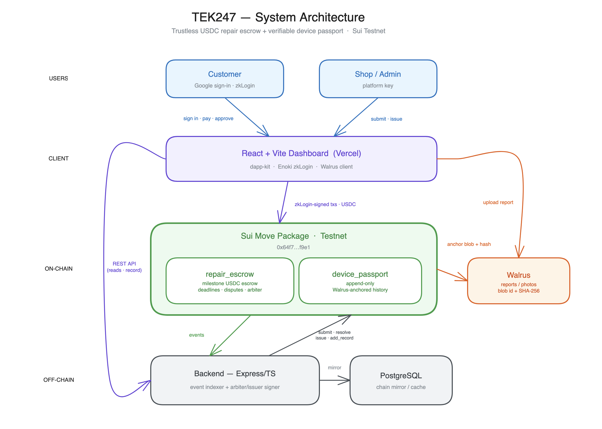

# TEK247 — Trustless repairs & verifiable devices on Sui

> **Pay for laptop repairs without the risk.** Milestone **USDC escrow** + a **Walrus-anchored,
> on-chain device passport**, with **walletless Google (zkLogin)** onboarding — for real-world
> laptop repair & resale.

**Sui Overflow 2026 · Track: DeFi & Payments · Network: Sui Testnet**

🔗 **Live app:** https://tek247.vercel.app
🩺 **API health:** https://tek247-backend-production.up.railway.app/health
📦 **Move package:** [`0x64f7…f9e1`](https://suiscan.xyz/testnet/object/0x64f7db7a66b5367947bd2a6b7e3751b0b6350dde7a12680903717a2052bff9e1)

---

## The problem (why it matters)

In emerging markets, buying or repairing a used laptop is a **trust minefield**:

- **Fake specs & counterfeit parts** — "16GB RAM" that's really 8GB; a refurb sold as new.
- **Stolen devices** — no way to verify a unit's real history.
- **"I paid, but it was never fixed"** — cash-based, informal commerce with **no recourse** for
  either the customer *or* the shop.

This is a real, at-scale trust problem in an informal economy. TEK247 replaces "just trust me"
with **verifiable, on-chain guarantees** — money *and* device history — on infrastructure normal
people can actually use.

## What we built

Two things, working together inside a Web2 repair & resale app:

1. **Trustless milestone escrow (DeFi).** A customer funds a repair into an on-chain **USDC**
   escrow. Funds release **stage by stage** (Diagnosis → Repair → Delivery), and **only on the
   customer's approval**. Deadlines, disputes, and a neutral capability-gated **arbiter** protect
   both sides — the shop can't take the money early, the customer can't grief the shop.

2. **Verifiable device passport.** When a repair completes, the diagnostic report + photos are
   stored on **Walrus**, and a **SHA-256 hash + blob id are anchored** on the device's on-chain
   passport. The history is **append-only and tamper-evident**, and the passport **survives
   resale** — so any future buyer can verify the device's whole life.

Onboarding is **walletless**: customers sign in with **Google (Sui zkLogin via Enoki)** — a real
Sui account, **no wallet, no seed phrase**.

## How it works

<p align="center">
  
</p>

**Customer (zkLogin / Google):**
`Sign in with Google → fund a repair into USDC escrow → approve each milestone to release funds →
raise a dispute if needed.`

**Shop / Admin (platform key):**
`Submit completed milestones → resolve disputes as arbiter → issue the verifiable device passport.`

## How we use the Sui stack

| Layer | How TEK247 uses it |
| --- | --- |
| **Move smart contracts** | `repair_escrow` — milestone escrow **generic over `Coin<T>`**, with deadlines, dispute freezing, and a capability-gated arbiter. `device_passport` — append-only, Walrus-anchored repair history. |
| **zkLogin (via Enoki)** | Walletless onboarding — customers get a real Sui account from their Google identity. No seed phrase. |
| **Stablecoin settlement** | Escrow is **funded and released in USDC** on Sui. |
| **Walrus** | Verifiable data layer for repair artifacts — blob id + SHA-256 hash anchored on the on-chain passport. |
| **Sui objects** | The device passport is a transferable, **history-bearing object** that survives resale. |

## Smart contracts

`move/tek247/sources/` — deployed to testnet as package
[`0x64f7…f9e1`](https://suiscan.xyz/testnet/object/0x64f7db7a66b5367947bd2a6b7e3751b0b6350dde7a12680903717a2052bff9e1).

### `repair_escrow` (generic over `Coin<T>`)
| Function | Who | Purpose |
| --- | --- | --- |
| `create_escrow` | customer | Lock `Coin<T>` (USDC) into a milestone escrow with a deadline. |
| `submit_milestone` | shop | Mark a milestone's work as done (awaiting approval). |
| `approve_milestone` | customer | Approve a submitted milestone → release its funds to the shop. |
| `raise_dispute` | either party | Freeze the escrow for arbitration. |
| `resolve_dispute` | arbiter (cap) | Split funds customer/shop by basis points. |
| `refund_if_unstarted` | customer | Reclaim funds if the shop never started past the deadline. |

Authorization & state are enforced on-chain (e.g. `submit_milestone` asserts `sender == shop`,
`approve_milestone` asserts `sender == customer`), with typed error codes (`ENotShop`,
`ENotCustomer`, `EMilestoneNotPending`, …).

### `device_passport`
| Function | Who | Purpose |
| --- | --- | --- |
| `issue` | issuer (cap) | Create a `DevicePassport` for a device (serial **hash**, brand, model, owner). |
| `add_repair_record` | issuer (cap) | Append a `RepairRecord` (summary, Walrus blob id, content hash, timestamp). |

The passport stores the **hash** of the serial (not the raw serial) and an **append-only**
`vector<RepairRecord>` — records can be added but never edited or removed.

## Live, verifiable artifacts (Sui testnet)

| Artifact | Explorer |
| --- | --- |
| Move package | [`0x64f7…f9e1`](https://suiscan.xyz/testnet/object/0x64f7db7a66b5367947bd2a6b7e3751b0b6350dde7a12680903717a2052bff9e1) |
| Device passport (3 Walrus-backed records) | [`0x55a5…3f77`](https://suiscan.xyz/testnet/object/0x55a56f38f497824b0780d55cdb8050327c886384b164680d2a377275c18f3f77) |
| Completed milestone escrow | [`0xc417…d95cf`](https://suiscan.xyz/testnet/object/0xc417664c92f6ae8e47fd4cbec4857e983f2f4cfc85e80cd9b779acda992d95cf) |
| Disputed → arbiter-resolved escrow | [`0x72f2…3a85cad`](https://suiscan.xyz/testnet/object/0x72f25de29c71d06d3ff412f5b68caf4a91019a20c67ce93906f4e00fa3a85cad) |

## Tech stack

- **On-chain:** Sui Move (`repair_escrow`, `device_passport`), Walrus, USDC, zkLogin.
- **Frontend:** React + Vite + TypeScript, `@mysten/dapp-kit`, `@mysten/enoki`, Tailwind. → Vercel.
- **Backend:** Node + Express + TypeScript, PostgreSQL; on-chain **event indexer** + **arbiter/issuer
  signer** (the backend is no longer a custodian — it only mirrors chain state and signs cap-gated
  admin actions). → Railway.

## Repository structure

```
move/tek247/        Sui Move package — repair_escrow + device_passport (+ tests)
backend/            Express/TS API, Postgres, on-chain indexer + signer
frontend/           React/Vite dashboard (escrow + passport UI, zkLogin)
docs/               demo-runbook.md, demo-video-script.md, ui-ux-redesign.md
SUBMISSION.md       Overflow submission details
DEMO.md             Demo narrative + seeded artifacts
DEPLOY.md           Deployment runbook
```

## Run it locally

**Smart contracts**
```bash
cd move/tek247 && sui move build && sui move test
```

**Backend** (needs Postgres + a Sui platform key for admin actions)
```bash
cd backend
cp .env.example .env        # set DATABASE_URL, JWT secrets, GOOGLE_CLIENT_ID, SUI_PLATFORM_SECRET_KEY
npm install
npm run db:migrate          # dbmate up
npm run dev                 # http://localhost:5000
```

**Frontend**
```bash
cd frontend
cp .env.example .env        # set VITE_API_BASE_URL, VITE_ENOKI_API_KEY, VITE_GOOGLE_CLIENT_ID, VITE_SUI_PACKAGE_ID
npm install
npm run dev                 # http://localhost:5173
```

See `DEPLOY.md` for the production setup (Vercel + Railway + Postgres + migrations).

## Built during the hackathon (eligibility)

The TEK247 repair-marketplace web app (Web2 marketplace, repairs, orders, deliveries, admin) is
**pre-existing scaffolding**. Built **new during Overflow 2026** and submitted as the substantial
new functionality:

- Two Move modules — `repair_escrow` and `device_passport` — deployed to testnet.
- zkLogin (Enoki) walletless payment flow.
- Walrus storage integration for verifiable repair reports.
- Backend re-architected as an on-chain **indexer + arbiter/issuer signer** (no longer a custodian).
- Full escrow + passport UI inside the repair flow.

## Roadmap

- **Enoki gas sponsorship** for a true zero-fee, walletless payment (private-key backend signer).
- **Mainnet** USDC settlement.
- **Verified-resale marketplace** where provable history sets price.
- **On-chain reputation** for shops and customers, built from settled escrows.
- A shared, trusted **device-history network** across partner repair shops.

## Business model

Take-rate on escrowed transactions; premium verified-resale listings; B2B passport issuance for
other repair shops — capturing **GMV from real-world repair & resale transactions** as they move
on-chain.

## Team

- _<name(s), roles, GitHub handles>_
- KYC: _<member completing KYC>_ — at least one required to receive prizes.

## License

_<choose a license, e.g. MIT>_
